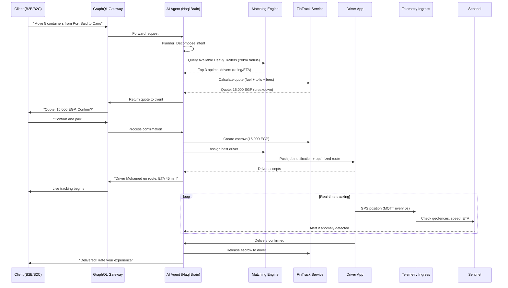

# Naql.ai System Architecture Document

## 1. Overview

Naql.ai is an autonomous logistics ecosystem designed specifically for the Egyptian market. It uses an **Event-Driven Microservices Architecture (EDMA)** with regional sharding ("Cells") to ensure nation-scale reliability, low-latency tracking, and AI-driven dispatching.

## 2. Architecture Diagram

```
┌──────────────────────────────────────────────────────────────────┐
│                     CLIENT LAYER                                  │
│  ┌──────────┐  ┌──────────┐  ┌──────────┐  ┌──────────────────┐ │
│  │ Mobile   │  │ Web      │  │ ERP      │  │ Driver App       │ │
│  │ (B2B/B2C)│  │ Dashboard│  │ (SAP/    │  │ (Android/iOS)    │ │
│  │          │  │          │  │  Oracle) │  │                  │ │
│  └────┬─────┘  └────┬─────┘  └────┬─────┘  └───────┬──────────┘ │
└───────┼──────────────┼──────────────┼───────────────┼────────────┘
        │              │              │               │
        ▼              ▼              ▼               ▼
┌──────────────────────────────────────────────────────────────────┐
│                   API GATEWAY LAYER                               │
│  ┌────────────────────────────────────────────────────────────┐  │
│  │              GraphQL Gateway (Strawberry/FastAPI)           │  │
│  │                    Port 4000                                │  │
│  │   ┌─────────────┐  ┌──────────┐  ┌───────────────────┐   │  │
│  │   │ Auth        │  │ Rate     │  │ Request           │   │  │
│  │   │ Middleware  │  │ Limiter  │  │ Validation        │   │  │
│  │   └─────────────┘  └──────────┘  └───────────────────┘   │  │
│  └────────────────────────────────────────────────────────────┘  │
└──────────────────────────────────────────────────────────────────┘
        │              │              │               │
        ▼              ▼              ▼               ▼
┌──────────────────────────────────────────────────────────────────┐
│                   SERVICE MESH (gRPC)                             │
│                                                                   │
│  ┌──────────┐  ┌──────────┐  ┌──────────┐  ┌──────────────┐    │
│  │ Identity │  │ Fleet    │  │ Matching │  │ FinTrack     │    │
│  │ Service  │  │ Service  │  │ Engine   │  │ Service      │    │
│  │ :8001    │  │ :8002    │  │ :8003    │  │ :8004        │    │
│  └──────────┘  └──────────┘  └──────────┘  └──────────────┘    │
│                                                                   │
│  ┌──────────────────┐  ┌──────────────────────────────────┐     │
│  │ Agent            │  │ Telemetry Ingress                │     │
│  │ Orchestrator     │  │ (MQTT → Stream Processing)      │     │
│  │ :8005            │  │ :8006                            │     │
│  └──────────────────┘  └──────────────────────────────────┘     │
└──────────────────────────────────────────────────────────────────┘
        │              │              │               │
        ▼              ▼              ▼               ▼
┌──────────────────────────────────────────────────────────────────┐
│                   EVENT BUS & MESSAGING                           │
│  ┌────────────────────┐  ┌────────────────────────────────────┐ │
│  │ NATS JetStream     │  │ EMQX MQTT Broker                  │ │
│  │ (Domain Events)    │  │ (Truck Telemetry)                  │ │
│  │ :4222              │  │ :1883                              │ │
│  └────────────────────┘  └────────────────────────────────────┘ │
└──────────────────────────────────────────────────────────────────┘
        │              │              │               │
        ▼              ▼              ▼               ▼
┌──────────────────────────────────────────────────────────────────┐
│                   DATA LAYER                                      │
│  ┌──────────────┐  ┌──────────────┐  ┌──────────────────────┐  │
│  │ CockroachDB  │  │ TimescaleDB  │  │ Redis Stack          │  │
│  │ (Transact.)  │  │ (Time-Series)│  │ (Geospatial Cache)   │  │
│  │ :26257       │  │ :5432        │  │ :6379                │  │
│  └──────────────┘  └──────────────┘  └──────────────────────┘  │
└──────────────────────────────────────────────────────────────────┘
```

## 3. Regional Cell Architecture

Egypt is divided into operational "Cells" for data locality and failure isolation:

| Cell Code | Region | Major Cities |
|-----------|--------|-------------|
| EG-CAI | Greater Cairo | Cairo, Giza, Qalyubia |
| EG-ALX | Alexandria | Alexandria, Beheira, Matrouh |
| EG-SUE | Suez Canal Zone | Suez, Ismailia, Port Said, Red Sea |
| EG-DLT | Nile Delta | Sharqia, Dakahlia, Damietta, Gharbia |
| EG-UEG | Upper Egypt | Minya, Asyut, Sohag, Luxor, Aswan |
| EG-SIN | Sinai | North Sinai, South Sinai |
| EG-WST | Western Desert | New Valley |

## 4. AI Agent Architecture (LangGraph)

```
┌─────────────────────────────────────────────────────┐
│                 Agent Orchestrator                    │
│                                                       │
│  ┌───────────┐    ┌──────────────┐    ┌───────────┐ │
│  │  PLANNER  │───▶│  EXECUTOR    │───▶│ DISPATCHER│ │
│  │           │    │              │    │ (OR-Tools)│ │
│  │ Decompose │    │ Tool Calls   │    │           │ │
│  │ Intent    │    │ to Services  │    │ CVRP      │ │
│  └───────────┘    └──────────────┘    │ Solver    │ │
│       │                               └─────┬─────┘ │
│       │                                     │       │
│       ▼                                     ▼       │
│  ┌───────────────────────────────────────────────┐  │
│  │              SENTINEL (Monitor)                │  │
│  │                                                │  │
│  │  • Truck breakdowns → Re-assign                │  │
│  │  • Geofence violations → Alert                 │  │
│  │  • ETA deviations → Recalculate               │  │
│  │  • Speed violations → Warn driver             │  │
│  └───────────────────────────────────────────────┘  │
│                                                       │
│  ┌───────────────────────────────────────────────┐  │
│  │        VECTOR MEMORY (Pinecone)                │  │
│  │                                                │  │
│  │  • User preferences                           │  │
│  │  • Interaction history                         │  │
│  │  • Learned patterns (RAG)                      │  │
│  └───────────────────────────────────────────────┘  │
└─────────────────────────────────────────────────────┘
```

## 5. Data Flow: Order to Delivery



## 6. Technology Stack

| Layer | Technology | Purpose |
|-------|-----------|---------|
| Language | Python 3.12+ | All services |
| API Framework | FastAPI | REST + gRPC endpoints |
| GraphQL | Strawberry | External API gateway |
| Internal Comm | gRPC (protobuf) | Service-to-service |
| Event Bus | NATS JetStream | Async domain events |
| MQTT Broker | EMQX | Low-bandwidth telemetry |
| Transactional DB | CockroachDB | Orders, users, payments |
| Time-Series DB | TimescaleDB | GPS, sensors, telemetry |
| Cache/Geo Index | Redis Stack | Real-time geospatial |
| AI Framework | LangGraph | Agent orchestration |
| Optimization | Google OR-Tools | Route/dispatch solver |
| Vector DB | Pinecone | Agent long-term memory |
| Container | Docker | Service packaging |
| Orchestration | Kubernetes (EKS) | Production deployment |

## 7. Egyptian Context Adaptations

### Payment Integration
- **Fawry**: Cash payment network (kiosks, mobile)
- **Paymob**: Card payments + mobile wallets
- **Valu**: Buy-now-pay-later for enterprise
- **Bank transfers**: For large enterprise contracts

### Toll Calculation ("Cartas")
Automated toll calculation for major Egyptian routes:
- Cairo ↔ Alexandria (Desert Road): 180 EGP
- Cairo ↔ Suez: 120 EGP
- Cairo ↔ Delta: 80 EGP
- Cairo ↔ Upper Egypt: 200 EGP

### Truck Categories (Egyptian Market)
- ربع نقل (Quarter Load): 1,500 kg
- نص نقل (Half Load): 3,000 kg
- نقل كامل (Full Load): 7,000 kg
- جامبو (Jumbo): 15,000 kg
- مقطوره (Trailer): 25,000 kg
- مبرد (Refrigerated): 12,000 kg

### Geofence Zones
Pre-configured micro-geofences for major logistics hubs:
- Sokhna Port
- Damietta Port
- Alexandria Port
- 10th of Ramadan City
- 6th of October City
- Cairo Ring Road
- Suez Canal Zone
- Sadat City
